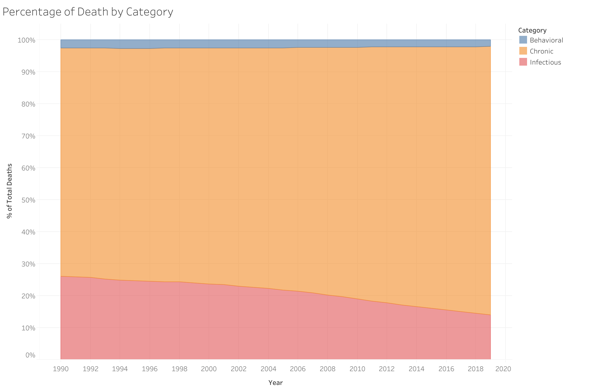
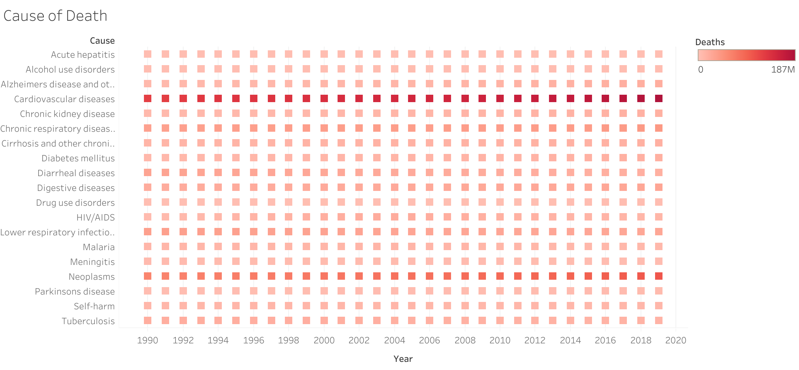
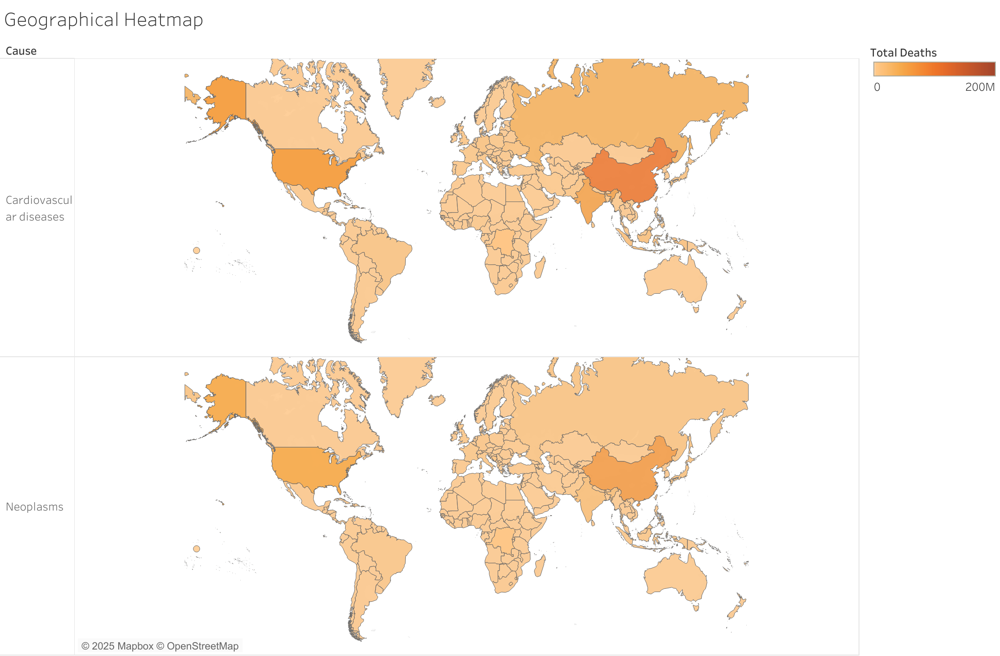

# Global Mortality Trends: Causes of Death Over Time

> A data storytelling project analyzing global death causes using SQL and Tableau.

---

## Project Overview

This project explores patterns in global mortality using the *Our World in Data - Causes of Death* dataset (https://www.kaggle.com/datasets/ivanchvez/causes-of-death-our-world-in-data?select=20220327+annual-number-of-deaths-by-cause.csv). Using SQL to clean and restructure the dataset, and Tableau to visualize mortality trends, I aimed to uncover how the leading causes of death have evolved over time across different regions.

---

## Objectives

- Identify leading causes of death globally and by region
- Group causes into categories: infectious, behavioral, and chronic
- Analyze temporal trends from 1990 to 2019
- Deliver actionable insights through compelling visuals and clean SQL analysis

---

## Tools & Skills Used

- **SQL (MySQL Workbench)** – data cleaning, transformation, normalization
- **Tableau Public** – dashboard design and storytelling
- **Data Modeling** – converting wide data to long format for flexible analysis
- **Data Storytelling** – clear communication of insights with visuals and structure
- **Git & GitHub** – version control and documentation

--

## Data Cleaning & Transformation (SQL)

I began by importing and preparing the data using MySQL. Key transformations included:

- Cleaning and Dropping redundant columns
- Reshaping from wide to long format with SQL `UNION ALL`
- Creating a normalized table `death_cat` with columns: `Entity`, `Year`, `Category`, `Cause`, `Deaths`

Explore the code:
- 🔗 [SQL: Data Processing and Queries](sql/WorldDeaths.sql)
- 🔗 [Raw Data](Raw/DeathbyCause)

---

## Data Visualization & Insights

### 1. Global Mortality by Cause Category

Infectious diseases have declined over time due to global health initiatives, while chronic conditions show persistent or increasing trends.

---

### 2. Chronic Disease Trends Over Time

The most prevelant chronic diseases is Cardiovascular disease and Neoplasms (cancers). These two have consistently lead in total deaths from 1990 to 2019. These trends highlight a growing global burden of chronic, non-communicable diseases (NCDs).

---

### 3. Regional Comparison of Deaths by Cause

This geographical heat map shows the countries where CVD and Neoplasms are killing the most people, depicting the highest impacted areas by these chronic conditions.

---

## Interactive Dashboards

Explore the full dashboards and interactive charts here:
[My Tableau Public Profile](https://public.tableau.com/app/profile/jovan.rai)

---

## Key Findings

- **Chronic diseases** (e.g., cardiovascular, cancer) are the top killers globally, and are most prevelent in the United States of America and China.
- **Infectious diseases** have declined sharply since the early 2000s, likely due to the emphasis on modern medicine.
- **Behaviour related deaths** have been steady for the past 3 decades.
- **Some conditions** (e.g., Alzheimer’s) are rising due to aging populations.

---

## Applications & Next Steps

- **Public health policy** can use these trends to reallocate funding and focus on chronic disease prevention.
- **Further research** could normalize the data by population to calculate per-capita mortality rates.
- **Time series forecasting** using Python or R could help predict future mortality burdens.

---
